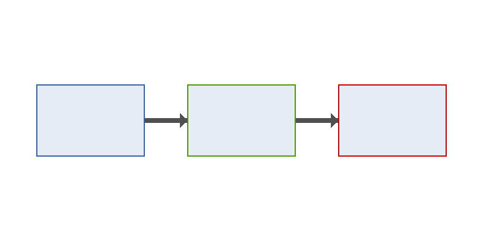

<!-- Built by the `texcache` CMake target with every coverage style, so that
     every LaTeX package PlaciDocs can emit ends up in the bundled cache. -->

# Sampul {cover}

# Lembar Pengesahan {pengesahan}

# Pengantar {pembuka}

Teks pembuka [@a].

# Daftar Isi {pembuka daftar isi}

# Daftar Gambar {pembuka daftar gambar}

# Daftar Tabel {pembuka daftar tabel}

# Daftar Rumus {pembuka daftar rumus}

# Daftar Grafik {pembuka daftar grafik}

# Isi

Teks **tebal**, *miring*, ~~coret~~, `kode`, $x^2$, [tautan](https://example.org), @a, lihat @fig:a.

{#fig:a width=30%}

{#gfk:b width=30%}

Tabel: Tabel {#tbl:a}

| A | B | C | D | E | F | G |
|---|:-:|--:|---|---|---|---|
| 1 | 2 | 3 | 4 | 5 | 6 | 7 |

```math {#eq:a caption="Rumus"}
a &= b \\
c &= d
```

$$
\sum_{i=1}^{n} \int_0^1 \prod_k \oint \bigcup \bigcap \coprod \left( \frac{a}{b} \right) \Big[ \Bigg\{ \sqrt[3]{x} \Bigg\} \Big] \left\| v \right\|
$$ {#eq:b}

$$
\mathbb{R} \mathcal{L} \mathfrak{g} \boldsymbol{\alpha} \mathbf{x} \mathsf{s} \mathtt{t} \mathit{i} \leq \geq \neq \approx \equiv \sim \propto
\infty \nabla \partial \forall \exists \emptyset \subseteq \supset \in \notin \rightarrow \Leftrightarrow \mapsto \hookrightarrow \leadsto
\cdots \ddots \vdots \hat{x} \tilde{y} \bar{z} \vec{v} \dot{a} \ddot{b} \overbrace{a+b}^{n} \underbrace{c}_{m} \overline{xy} \widehat{xyz}
\alpha \beta \Gamma \Delta \Theta \Lambda \Xi \Pi \Sigma \Phi \Psi \Omega \varepsilon \vartheta \varphi \ell \hbar \aleph
\lesssim \gtrsim \blacksquare \square \checkmark \circledR \mathbb{Z} \mathbb{N} \mathbb{Q} \mathbb{C}
\begin{pmatrix} 1 & 0 \ 0 & 1 \end{pmatrix} \begin{bmatrix} a \end{bmatrix} \binom{n}{k} \tfrac{1}{2} \dfrac{3}{4}
$$

Teks: ~ ^ \ { } # $ % & _ “kutip” ‘tunggal’ — – … © ° € ± × ÷ ½ α β.

```python
print("kode")
```

> Kutipan.

1. satu
   - dua

::: DuaKolom
Kolom. 
::: DuaKolom

{halaman-baru}

# Referensi {penutup pustaka}

# Lampiran {lampiran}

| No | Isi |
|---:|-----|
| 1 | a |
| 2 | b |
| 3 | c |
| 4 | d |
| 5 | e |
| 6 | f |
| 7 | g |
| 8 | h |
| 9 | i |
| 10 | j |
| 11 | k |
| 12 | l |
| 13 | m |
| 14 | n |
| 15 | o |
| 16 | p |
| 17 | q |
| 18 | r |
| 19 | s |
| 20 | t |
| 21 | u |
| 22 | v |
| 23 | w |
| 24 | x |
| 25 | y |
| 26 | z |
